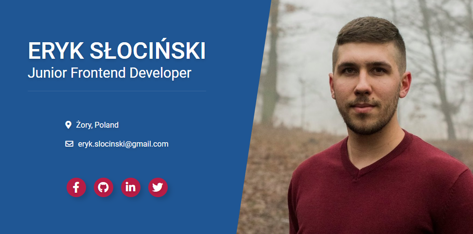

 

# modern-resume

Hello there! This is my simple business card website. It was created to help me to get a job as a junior frontend developer.

:fire: :fire: **[DEMO](https://erq-programmer.github.io/modern-resume/)** :fire: :fire:

## Screenshots

## Technologies

- HTML
- SCSS
- JS (soon...)

## Status

Project is: _in progress_

To-do list:

- [ ] Need backend for contact form

## Contact

Created by [@erykslocinski](mailto:eryk.slocinski@gmail.com) - feel free to contact me!
